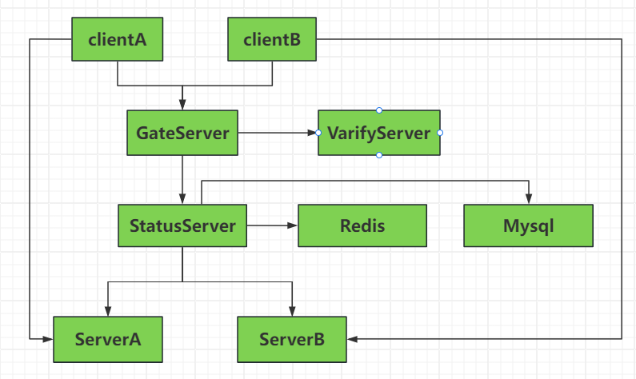
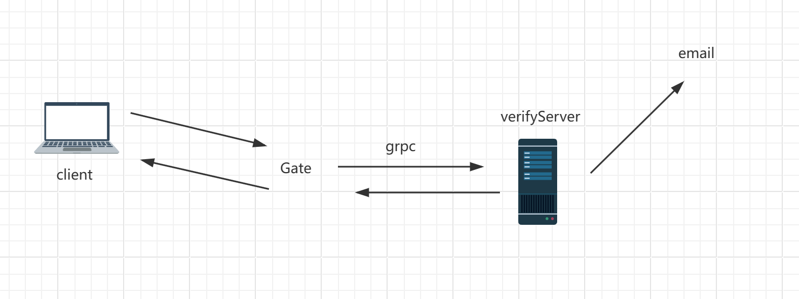
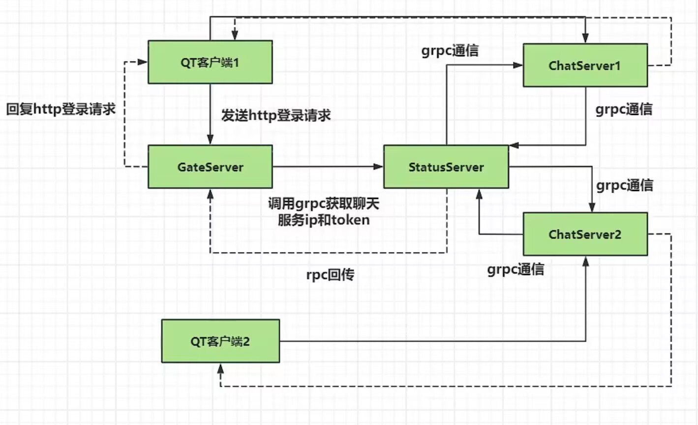
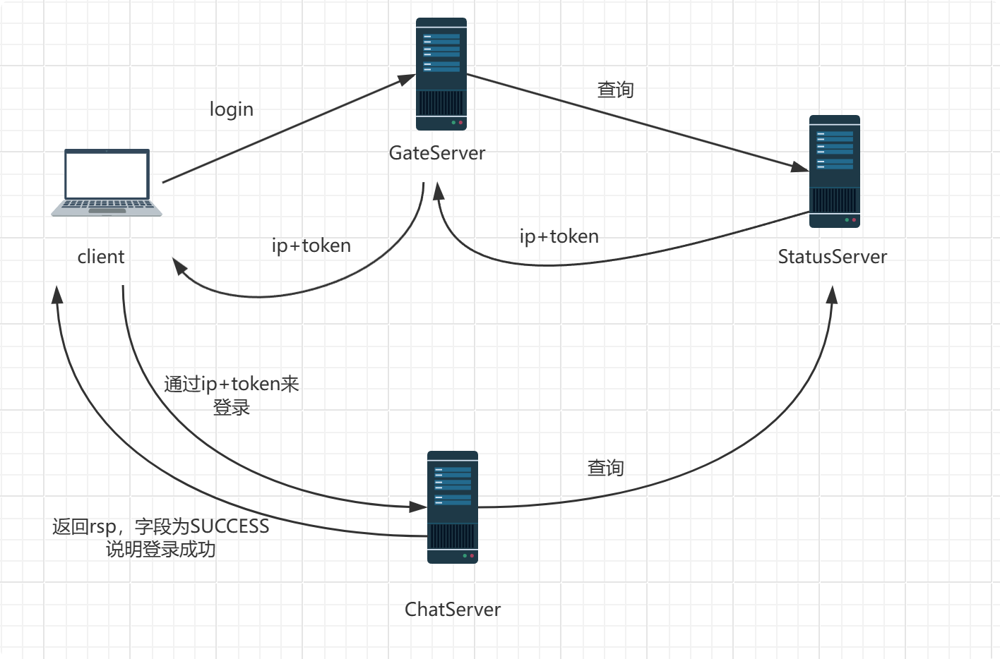
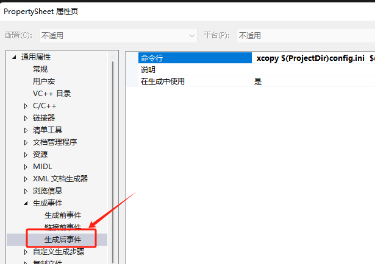
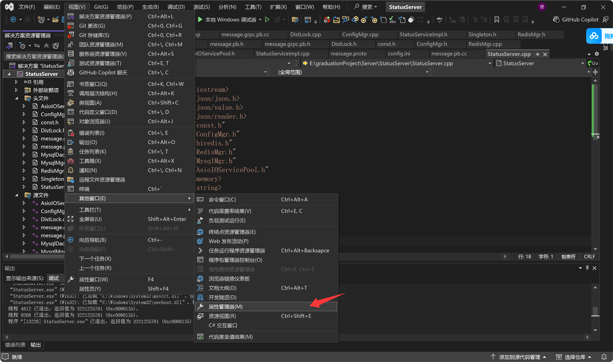

# 特别感谢恋恋风辰zack

源码参考链接： https://gitee.com/secondtonone1/llfcchat  

文档参考链接： https://gitbookcpp.llfc.club/sections/cpp/project/day01.html 

# 架构设计

 

# 使用CRTP实现Http的管理者

**CRTP** 全称是 **Curiously Recurring Template Pattern**，中文常译为 **“奇异递归模板模式”**。

它是 C++ 模板元编程中一种非常经典且强大的技巧，核心目的是**用“编译时多态”（静态多态）替代“运行时多态”（虚函数）**，从而在保持代码复用性和扩展性的同时，消除虚函数表的性能开销。

# boost与jsoncpp

https://www.boost.org/

PS E:\Program Files\boost_1_90_0> .\b2.exe install --toolset=msvc-14.3 --build-type=complete --prefix="E:\Program Files\boost_1_90_0" link=static runtime-link=shared threading=multi debug release

boost与jsoncpp库用来搭建网关服务器

# grpc简介

gRPC是Google开发的一种高性能、开源的远程过程调用（RPC）框架。它可以让客户端应用程序像调用本地服务一样轻松地调用远程服务，并提供了多种语言的支持，如C++、Java、Python、Go等。

gRPC使用Protocol Buffers作为数据格式，可以在不同的平台上进行应用程序之间的通信，支持多种编程语言和多种操作系统。它采用基于HTTP/2的协议，提供了高效、快速且可扩展的远程调用功能，并带有负载均衡、认证、监控等功能，方便用户管理和维护分布式系统。

gRPC可用于构建各种类型的分布式应用程序，如微服务、云原生应用程序、大规模Web应用程序、移动应用程序等场景。由于其高性能和可扩展性，越来越多的企业和组织开始采用gRPC来构建他们的应用程序和服务。



# 使用Nodejs实现邮箱认证服务

 npm run serve

# 使用iocontext连接池提高并发

# 设置验证码过期

我们的验证码是要设置过期的，可以用redis管理过期的验证码自动删除，key为邮箱，value为验证码，过期时间为3min。

# 启动本地windows的redis服务

.\redis-server.exe  .\redis.windows.conf 

# 登录验证和状态服务



 

登录流程总览

1. 客户端发起登录请求到Gate Server。
2. Gate Server去Status Server查询，获取可用的Chat Server的IP和token。
3. Gate Server将Chat Server的IP和token返回给客户端。
4. 客户端用这个IP和token，建立到Chat Server的TCP长连接。
5. Chat Server收到连接后，向Status Server验证token和用户信息。
6. 验证通过后，Chat Server允许登录，并返回登录结果给客户端。
7. 客户端登录成功，进入聊天界面。

队列能够保证异步发送的有序性


# 各种问题汇总

work在新的boost库了已经不能用了，官方文档里写到work (Deprecated: Use executor_work_guard.)； 代码需要修改成： using Work = boost::asio::executor_work_guard\<boost::asio::io_context::executor_type>; 构造函数部分： _works【i】 = std::unique_ptr\<Work>(new Work_ioServices【i】.get_executor())); 

for (auto& work : _works) {
	//把服务先停止
	//work->get_io_context().stop();
	work.reset();
}
// 遍历 io_context 并停止它们
for (auto& io_ctx : _ioServices) {
	io_ctx.stop();
}

为了让项目自动将dll拷贝到运行目录，可以在生成事件->生成后事件中添加xcopy命令 



```c++
xcopy $(ProjectDir)config.ini  $(SolutionDir)$(Platform)\$(Configuration)\   /y
xcopy $(ProjectDir)*.dll   $(SolutionDir)$(Platform)\$(Configuration)\   /y
```



